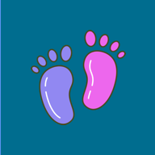
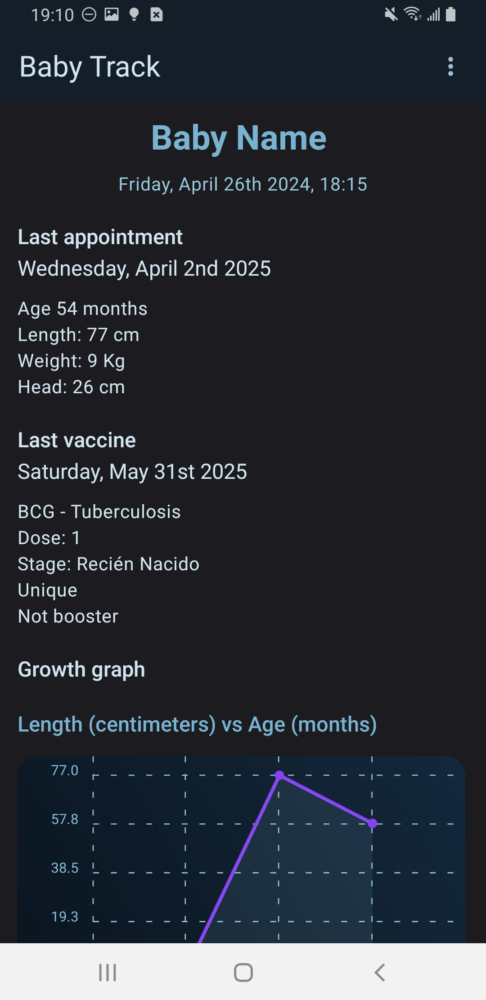
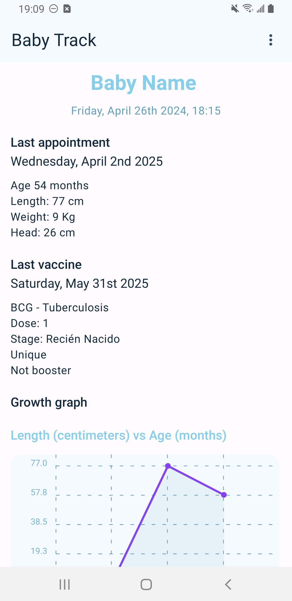
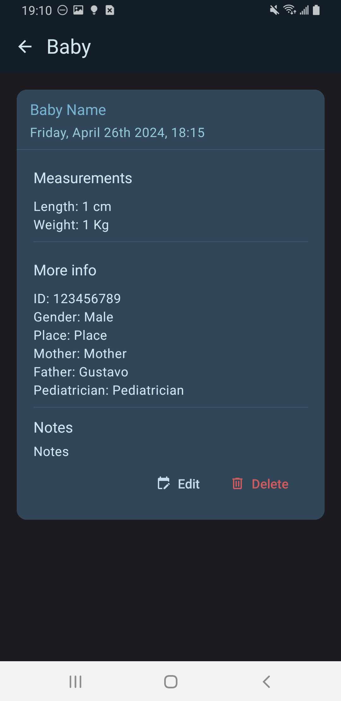
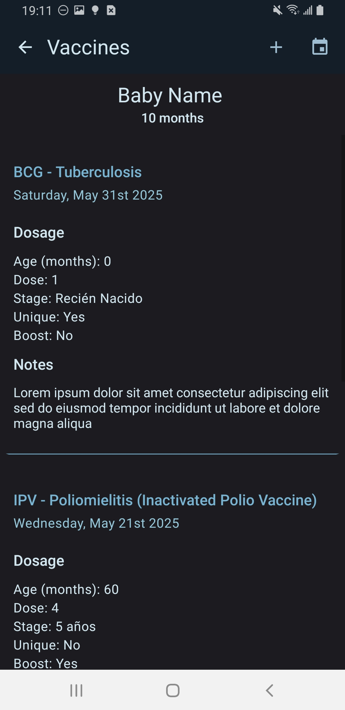
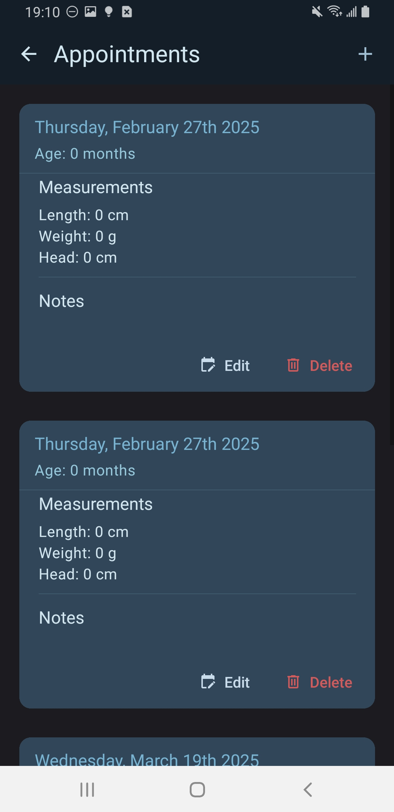
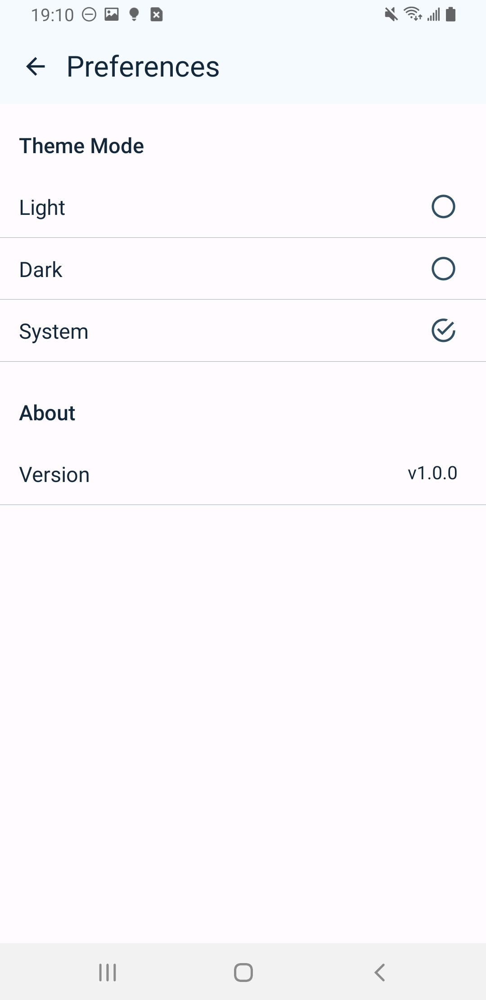

# BabyTrack
### Track your baby's growth, doctor visits, and vaccine schedule effortlessly.

"Baby Track" is a user-friendly mobile app designed to help parents effortlessly monitor their baby's growth and health. the app allows you to record and visualize your baby's weight and height over time. It also includes features to track vaccination schedules, with reminders for upcoming vaccines.

Additionally, "Baby Track" stores essential birth details like the date, time, gestational weeks, doctor, and hospital, making it a comprehensive tool for keeping all your baby's key information in one place. Designed with simplicity in mind, "Baby Track" ensures that parents can easily and quickly access the information they need to support their baby's health and development.

## Features

- **Track Growth Progress:** Record your baby's weight, height, and head circumference, and visualize progress with beautiful, easy-to-read graphs.
- **Stay on Top of Doctor Visits:** Never miss an important check-up! Keep track of upcoming doctor appointments and set reminders.
- **Vaccine Calendar:** View a complete vaccination schedule, log vaccines received, and get notified about upcoming doses.
- **Private & Secure:** Your data stays on your device, ensuring complete privacy.

## Screenshot Gallery

|  |  |
|----------------------------|-----------------------------|
| Home (Dark) | Home (Light) |

|  |  |
|-----------------------------------------|----------------------------------------|
| Baby (Light) | Baby (Dark) |

|  |  |
|-----------------------------------------|----------------------------------------|
| Vaccines (Light) | Vaccines (Dark) |

|  | 
|-----------------------------------------|----------------------------------------|
| Appointments (Light) | Appointments (Dark) |

|  |  |
|-----------------------------------------|----------------------------------------|
| Settings (Light) | Settings (Dark) |

## Privacy Policy

Your privacy and security are my top priorities when using BabyTrack. This Privacy Policy outlines how your data is collected, used, and protected:

- **Data Collection:** BabyTrack doesn't collect any information from the user, except for the baby’s growth records (such as weight, height, and vaccination details) entered by them.
- **Data Storage:** All data entered into BabyTrack is stored locally on your device. The app does not transmit or store any user data on external servers or third-party platforms.
- **Data Access:** BabyTrack does not access, share, or sell any user data to third parties. Your information remains solely within your control and is not shared with anyone, including the developer.
- **Security Measures:** I take security seriously and have implemented measures to protect your data from unauthorized access, alteration, disclosure, or destruction.
- **Consent:** By using BabyTrack, you consent to the collection and use of your data as outlined in this Privacy Policy.
- **Policy Updates:** This Privacy Policy may be updated periodically. Any changes will be reflected in the app, and continued use of BabyTrack constitutes acceptance of the revised policy.

If you have any questions or concerns about this Privacy Policy, feel free to contact me.

## License

[Apache License](LICENSE)
